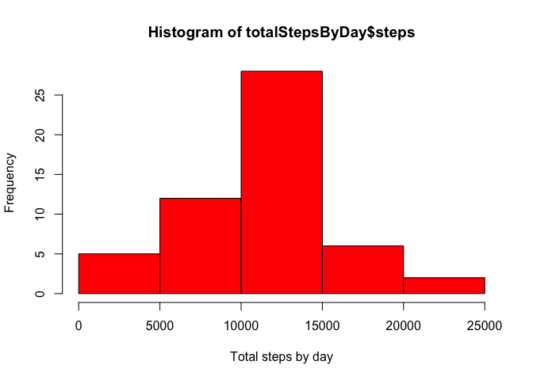
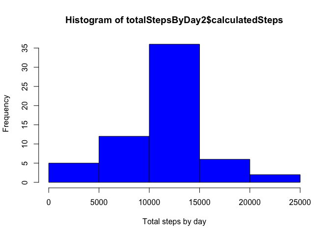

# Reproducible Research: Peer Assessment 1


## Loading and preprocessing the data


```r
File <- "./activity.csv"
data <- read.csv(File, header = TRUE)
data$date <- as.Date(data$date)
```

## What is mean total number of steps taken per day?

### Step 1: Calculate the total number of steps taken per day


```r
totalStepsByDay <- aggregate(steps ~ date,data, sum, rm.na = TRUE)
```

### Step 2: Make an histogram of the total number of steps by day


```r
hist(totalStepsByDay$steps, col="green", xlab ="Total steps by day")
```

<!-- -->

### Step 3: Calculate and report the mean and median of the total number of steps taken per day


```r
z <- mean(totalStepsByDay$steps)
print(z)
```

```
## [1] 10767.19
```


```r
y <- median(totalStepsByDay$steps)
print(y)
```

```
## [1] 10766
```

 
## What is the average daily activity pattern?

### Step 1: Make a time series plot of the 5 minute interval and the average numbers of steps taken, averaged across all days


```r
avgStepsByInterval <- aggregate(steps ~ interval, data, mean, rm.na = TRUE)

plot(avgStepsByInterval$interval,avgStepsByInterval$steps,type ="l",xlab="Interval", ylab = "Average number of steps")
```

<!-- -->

### Step 2: Identify which is the interval that contains the maximum number of steps

```r
i <- avgStepsByInterval[which.max(avgStepsByInterval$steps),]
print (i)
```

```
##     interval    steps
## 104      835 206.1698
```


## Imputing missing values

### Step 1: Calculate the total number of missing values in the dataset

```r
x <- sum(!complete.cases(data))
```

The total number of missing values is 2304

### Steps 2 & 3: Replace missing date with the average number of steps fo that interval and create a new data set with the missing values filled in

```r
imputedData <-  merge(data,avgStepsByInterval, by = "interval")
imputedData$calculatedSteps <- with(imputedData,ifelse(is.na(steps.x),steps.y,steps.x))
imputedData <- subset(imputedData, select =c("calculatedSteps","date","interval"))
```

###Step 4.1: Make an histogram of the toal number of steps taken by day with the new calculated steps


```r
totalStepsByDay2 <- aggregate(calculatedSteps ~ date,imputedData, sum)

hist(totalStepsByDay2$calculatedSteps, col="green", xlab ="Total steps by day")
```

<!-- -->

### Step 4.2: calculate the mean and the median of the new calculated steps


```r
z2 <- mean(totalStepsByDay2$calculatedSteps)
print(z2)
```

```
## [1] 10766.19
```


```r
y2 <- median(totalStepsByDay2$calculatedSteps)
print(y2)
```

```
## [1] 10766.19
```

### Step 4.3: do the new values differ from the previously calculated ones


```r
diffMean <- z2 - z

print(diffMean)
```

```
## [1] -1
```

```r
diffMedian <- y2 - y

print(diffMedian)
```

```
## [1] 0.1886792
```


## Are there differences in activity patterns between weekdays and weekends?

###Step 1: Create a new factor variable with two levels: weekday or weekend


```r
imputedData$dayType <- with(imputedData,ifelse((weekdays(date) == "Saturday" | weekdays(date) == "Sunday") ,"Weekend","Weekday"))
```


###Step 2: Make a panel plot containing a time series plot of the 5-minute interval  and the average number of steps taken, averaged across all weekday days or weekend days 


```r
avgStepsByInterval2 <- aggregate(calculatedSteps ~ interval + dayType, imputedData, mean)

library(ggplot2)

ggplot(avgStepsByInterval2, aes(interval,calculatedSteps))  + facet_grid(.~dayType) + labs(x = "Interval") + labs(y = "Average Calculated Steps") + geom_line() +  geom_smooth() 
```

```
## `geom_smooth()` using method = 'loess'
```

<!-- -->

